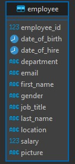

### Local Installataion

- Change all config on
  - RESTful API Express Js/src/config/db.ts
  - RESTful API Gin Gonic/src/config/db.go
  - RESTful API Spring Boot/src/main/resources/application.properties

- Turn on synchronize database
  - RESTful API Express Js/src/config/db.ts set synchronize to true

### Database Schema
